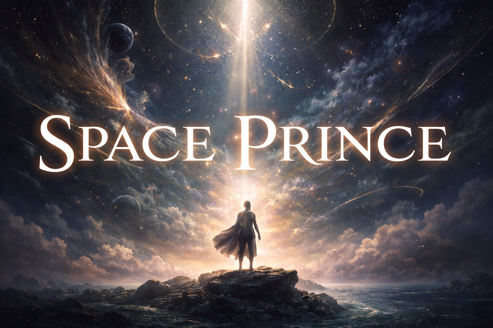

# Space Prince 🪐

Space Prince is an onchain, single-character RPG about identity, attention, and irreversible choice.

Each player recognizes a single **Prince**, defined by a unique latitude, longitude, and timestamp.
That position in spacetime can only ever be recognized once.

The Prince is not optimized, rerolled, or replaced.
It is inhabited.

---

## What This Is

- A **fully onchain** game (client UI only)
- A **single-character** experience (no collections, no alts)
- A **roguelike structure** where failure advances the world
- A **generative NFT** that evolves as a permanent record of play
- A game about **interpretation**, not mastery

Progress does not increase power.
It increases specificity.

---

## Core Ideas

- **Identity is irreversible**
  Minting recognizes an identity; it does not create one.

- **Power is cyclical, not hierarchical**
  No build, chart, or strategy is universally dominant.

- **Failure is canonical**
  Death leaves permanent trace and unlocks new understanding.

- **Attention has cost**
  Each run is a deliberate passage, not a retry.

- **Silence is respected**
  Waiting and not playing are valid states.

---

## How You Act

On each turn, the player may choose one stance:

- **Think** — seek clarity
- **Wait** — yield to time
- **Fast** — impose constraint

All actions in the game are interpretations of these three.

---

## The Prince NFT

The Prince NFT is:

- The character
- The save file
- The artifact forged through play

It evolves deterministically based on:
- Identity (birth data)
- World interaction
- Failure and persistence

Death is recorded as **entropy**: the background slowly darkens, one pixel at a time, marking history without damaging identity.

---

## Monetization (Briefly)

- Minting a Prince requires a small, flat fee
- Each run requires a small, flat fee
- Nothing can be purchased to improve outcomes
- Observation, reflection, and waiting are always free

Money acknowledges commitment.
It never replaces it.

---

## What This Is Not

Space Prince is not:

- A TCG
- A hero collector
- A loot treadmill
- A competitive ladder
- A belief-driven astrology simulator
- A free-to-play engagement machine

It is not trying to entertain you.
It is trying to notice whether you stayed.

---

## Project Status

This repository currently contains design documents and conceptual groundwork.

Implementation is intentionally slow and deliberate.

---

## Reading Order

If you want to understand the project, look in the `spec/` folder.

---

## Closing

Space Prince treats the chain as canon, identity as sacred, and play as a form of attention.

If that sounds excessive, this is not for you.
If it sounds quiet, you’re in the right place.
